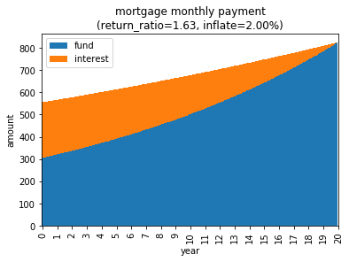

# pymort

Python simulation for mortgage plans.

DISCLAIMER: Pymort implements a number of calculators that may help in planning a loan, however it does not provide financial consulting of any kind, and does not replace the guidance of a professional advisor.

See the tutorial notebook [here](pymort_tutorial.ipynb).

### Features

* Multi-plan mortgages can be simulated under different inflation scenarios.

```
>>> mort = pymort.Mortgage()
>>> mort.add_plan(principal=100000, years=20, interest=3.0,
                  track_inflation=True, description='plan1')
>>> mort.plot(inflation=2.0)
```


* Multiple offers (e.g., from different banks) can be evaluated under different conditions to select a mortgage that fits your constraints (e.g., the maximal monthly payment throughout the duration of the plans).

```
inflat_0_00    1  <<< #1 is the cheapest offer for 0% inflation
inflat_0_50    1
inflat_1_00    1
inflat_1_50    2  <<< #2 is the cheapest offer for 1.5% inflation
inflat_2_00    2
```

* An interpolation model can help you decide on the period of the loan that you wish the bank to base its offer on. Based on a few initial offers, it can simulate predicted offers under different lenghts of terms, inflation scenarios and constraints.
    * For example, the combination of 18, 29, and 15 years in the table below results in favorable return ratios (the predicted cost of every loaned dollar) when the average yearly inflation rate increases above 1.5% (a result of which is that the monthly payments of the first offer exceed some limit and become too large to bear).

```
inflat_0_00    (16, 30, 16)
inflat_0_50    (16, 30, 16)
inflat_1_00    (16, 30, 16)
inflat_1_50    (18, 29, 15)
inflat_2_00    (15, 30, 22)  
```
